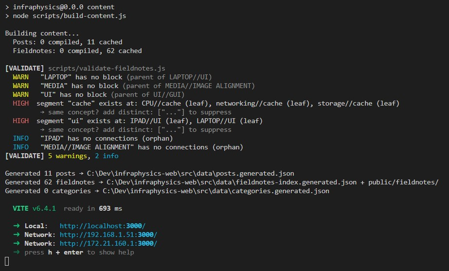

# Build Scripts

## `build-content.js`

Main content compiler. Transforms markdown into pre-rendered HTML with syntax highlighting, custom syntax processing, and link resolution.

### Pipeline (14 steps)

Both regular posts and fieldnotes pass through the same `compileMarkdown()` pipeline, in this exact order:

| # | Step | Phase | What it does |
|---|---|---|---|
| 1 | `protectBackticks` | Pre-marked | Shields fenced code blocks (` ``` `) and inline code (`` ` ``, ` `` `) with `%%CBLK_N%%` placeholders so no preprocessor touches code content |
| 2 | `applyPreProcessors` | Pre-marked | Runs regex rules from `compiler.config.js` (color, accent, underline, etc.). Heading lines (`# ...`) are temporarily replaced with `%%HEADING_N%%` so inline syntax never modifies them |
| 3 | `processCustomBlockquotes` | Pre-marked | Converts `{bkqt/TYPE}...{/bkqt}` blocks into typed blockquotes (note, tip, warning, danger, keyconcept, quote, pullquote). Supports definition lists and alpha lists inside blockquotes |
| 4 | `restoreBackticks` | Pre-marked | Restores `%%CBLK_N%%` → original code content |
| 5 | `processExternalUrls` | Pre-marked | Converts `[[https://...\|text]]` into `<a class="doc-ref doc-ref-external">` with external link icon. Runs before marked to prevent URL auto-linking corruption |
| 6 | `preprocessSideImages` | Pre-marked | Detects `` followed by text (no empty line). Wraps into `<div class="img-side-layout">` flexbox container |
| 7 | `processDefinitionLists` | Pre-marked | Converts `- TERM:: description` blocks into `<div class="defn-list">` with `<p class="defn">` items |
| 8 | `processAlphabeticalLists` | Pre-marked | Converts sequential `a. / A.` lines into `<ol type="a/A">` |
| 9 | `processContextAnnotations` | Pre-marked | Converts `>> YY.MM.DD - text` lines into `<div class="ctx-note">` with avatar, date formatting, and relative time computation vs article date |
| 10 | `marked.parse` | Marked | Standard GFM parsing. Custom renderer overrides: `blockquote` → `<div class="small-text">` (not `<blockquote>`), `image` → position classes + figcaption support |
| 11 | `stripHeadingFormatting` | Post-marked | Removes all inline HTML tags from `<h1>`-`<h4>` content (no `<code>`, `<em>`, `<strong>` inside headings) |
| 12 | `highlightCodeBlocks` | Post-marked | Shiki dual-theme highlighting. Wraps in `.code-terminal` with macOS dots, language label, copy button |
| 13 | `applyPostProcessors` | Post-marked | Runs post-processor regex rules from `compiler.config.js` (currently empty) |
| 14 | `processAnnotations` | Post-marked | Converts `{{ref\|explanation}}` into superscript notes. Works inside `<p>`, `<li>`, and `<td>` elements. Uses balanced-bracket parser for nesting. Runs inside `processOutsideCode` to skip `<pre>`/`<code>` |

### Image renderer

The custom marked renderer handles image positioning via the title field:

```markdown
         → 
    → 
        → 
          → 
 → <figure class="img-center"><figcaption>Caption</figcaption></figure>
```

Positions: `right`, `left`, `center`, `full`. Optional width suffix (e.g. `right:250px`). Pipe `|` in alt text splits into alt + figcaption.

### Blockquote types

```markdown
{bkqt/note}           → <div class="bkqt bkqt-note"> with "Note:" label
{bkqt/tip}            → "Tip:" label
{bkqt/warning}        → "Warning:" label
{bkqt/danger}         → "Danger:" label
{bkqt/keyconcept}     → "Key concept:" label
{bkqt/quote|Author}   → No label, attribution span
{bkqt/pullquote}      → No label, styled as pullquote
{bkqt/note|Custom}    → Custom label overrides default
```

Content inside blockquotes supports definition lists (`- term:: desc`), alphabetical lists (`a. / A.`), numbered lists, and standard markdown. Paragraphs separated by double newlines. Lines separated by single newlines get `bkqt-cont` class.

### Link processing

`processAllLinks` runs on ALL compiled HTML (regular + fieldnotes) after individual compilation. It resolves `[[...]]` links in a single pass:

| Pattern | Type | Output |
|---|---|---|
| `[[projects/slug\|Display]]` | Cross-doc link | `<a class="doc-ref doc-ref-projects" href="/lab/projects/slug">projects/Display</a>` |
| `[[threads/slug\|Display]]` | Cross-doc link | `<a class="doc-ref doc-ref-threads" href="/blog/threads/slug">threads/Display</a>` |
| `[[bits2bricks/slug\|Display]]` | Cross-doc link | `<a class="doc-ref doc-ref-bits2bricks" href="/blog/bits2bricks/slug">bits2bricks/Display</a>` |
| `[[address]]` | Wiki-ref | `<a class="wiki-ref" data-address="address">last-segment</a>` |
| `[[address\|Custom]]` | Wiki-ref | `<a class="wiki-ref" data-address="address">Custom</a>` |

Cross-doc links **require** display text (`|Display`). Missing display text produces a build error. Each cross-doc category has its own SVG icon. All link processing is wrapped in `processOutsideCode` to skip `<pre>`/`<code>` blocks.

### Outputs

| Output | Location | Contents |
|---|---|---|
| Regular posts | `src/data/posts.generated.json` | Projects, threads, bits2bricks with full HTML content. No fieldnotes. |
| Fieldnotes index | `src/data/fieldnotes-index.generated.json` | Metadata array (id, title, address, addressParts, references, trailingRefs, searchText, description). No `content` field. |
| Fieldnote content | `public/fieldnotes/{id}.json` | `{ "content": "<html>" }` per note. Served as static assets. Stale files auto-cleaned. |
| Categories | `src/data/categories.generated.json` | Category config from `_category.yaml` files. |

### Fieldnote metadata extraction

Each fieldnote `.md` file produces:

- **id**: derived from address — `//` → `--`, `/` → `-`, lowercased (e.g. `CPU//ALU` → `cpu--alu`)
- **displayTitle**: last segment of address
- **description**: first non-heading, non-image text line (wiki-refs stripped to plain text)
- **references**: all `[[...]]` addresses found in body
- **trailingRefs**: `[[...]]` links on the last contiguous lines (used for "see also" display)
- **searchText**: full HTML stripped of tags, lowercased (for client-side search)

### Incremental cache

**Cache file:** `.content-cache.json` (git-ignored)

```json
{
  "version": 1,
  "configHash": "<sha256-16 of compiler.config.js>",
  "posts":      { "<relative-path>": { "mtime": <ms>, "result": { ... } } },
  "fieldnotes": { "<filename>":      { "mtime": <ms>, "metadata": { ... }, "preLinkHtml": "..." } }
}
```

Cache logic:
- `configHash`: first 16 chars of SHA-256 of `compiler.config.js`. If it changes → full rebuild.
- Per-file `mtime` (milliseconds): if mtime matches → reuse cached output, skip compilation.
- `preLinkHtml`: fieldnotes store pre-link HTML so link resolution can always re-run.
- `processAllLinks` always runs on ALL content (link targets may change when notes are added/removed).
- Force full rebuild: `--force` flag or delete `.content-cache.json`.

### Shiki

10 languages loaded: typescript, javascript, python, rust, go, yaml, json, html, css, bash.

Per-language dual-theme pairs (`--shiki-dark` / `--shiki-light`):

| Language | Dark | Light |
|---|---|---|
| TypeScript, JavaScript | one-dark-pro | one-light |
| Python | catppuccin-mocha | catppuccin-latte |
| Rust | rose-pine | rose-pine-dawn |
| Go | min-dark | min-light |
| YAML, JSON | github-dark | github-light |
| **Default** (HTML, CSS, bash, unknown) | vitesse-dark | vitesse-light |

Unknown languages fall back to default themes gracefully (no build error). Code blocks without a language tag get the terminal wrapper but no highlighting.

### Build error handling

The build collects errors from two sources and fails if any exist:
1. **Build errors** (`buildErrors[]`): missing `address` in fieldnote frontmatter, cross-doc links missing display text
2. **Validation errors**: from `validate-fieldnotes.js` (see below)

Non-zero errors → `process.exit(1)`. Warnings (e.g. missing parent segments) do NOT fail the build.

---

## `compiler.config.js`

Centralized configuration consumed by `build-content.js`. Changing this file invalidates the entire cache (triggers full rebuild via `configHash`).

### Sections

#### `marked`
Options passed to `marked.setOptions()`:
- `gfm: true` — GitHub Flavored Markdown (tables, strikethrough, autolinks)
- `breaks: false` — single newlines do NOT produce `<br>` (need double newline for paragraph break)

#### `wikiLinks`
- `enabled`: master toggle for all `[[...]]` link processing
- `pattern`: regex for matching wiki-links (`/\[\[([^\]]+)\]\]/g`)
- `toHtml(address)`: converts address to `<a class="wiki-ref" data-address="...">` with last segment as display text

#### `imagePositions`
- `positions`: allowed position keywords (`right`, `left`, `center`, `full`)
- `titlePattern`: regex to extract position + optional width from image title field
- `classMap`: position → CSS class mapping (`center` → `img-center`, `right` → `img-float-right`, etc.)

#### `preProcessors`
Regex rules applied BEFORE `marked.parse`, in order. Heading lines are protected (never modified).

| Name | Syntax | Output |
|---|---|---|
| text-color | `{#ff0:text}` or `{#red:text}` | `<span style="color:#ff0">text</span>` |
| superscript | `{^:text}` | `<sup>text</sup>` |
| subscript | `{v:text}` | `<sub>text</sub>` |
| keyboard | `{kbd:text}` | `<kbd>text</kbd>` |
| shout | `{shout:text}` | `<p class="shout">text</p>` |
| underline | `_text_` | `<span style="text-decoration:underline">text</span>` |
| accent-text | `--text--` | `<span class="accent-text">text</span>` |

**Order matters**: curly-brace patterns (`{...}`) run first (unambiguous delimiters), then bare-delimiter patterns (`_..._`, `--...--`). The underline regex uses negative lookbehind/ahead (`(?<!\w)` / `(?!\w)`) to avoid matching mid-word underscores. The accent-text regex uses negative lookbehind/ahead to avoid matching CSS `---` separators.

#### `postProcessors`
Regex rules applied AFTER `marked.parse` (on HTML). Currently empty — reserved for future use.

#### `validation`
Boolean flags controlling which validation checks run:
- `validateRegularPostWikiLinks`: check that `[[wiki-refs]]` in regular posts point to existing fieldnote addresses
- `validateFieldnoteRefs`: check that `[[refs]]` inside fieldnotes point to existing fieldnote addresses
- `validateParentSegments`: warn when a parent address segment (e.g. `CPU` in `CPU//ALU`) has no dedicated fieldnote file

---

## `validate-fieldnotes.js`

Six-phase content integrity checker. Called automatically at the end of every build. Errors fail the build; warnings and info are logged but allowed. Output uses colored severity labels:



- `ERROR` (red) — fails the build
- `WARN` (yellow) — logged, build continues
- `HIGH` / `MED` / `LOW` (red/yellow/dim) — segment collision tiers, treated as warnings
- `INFO` (cyan) — informational, build continues

### Phase 1: Reference integrity (`validateFieldnoteRefs`, `validateRegularPostWikiLinks`)

Checks that every `[[address]]` reference resolves to an existing fieldnote.

- **Fieldnote → fieldnote**: inline `[[refs]]` and trailing `[[refs]]` must point to existing addresses
- **Regular post → fieldnote**: `data-address="..."` attributes in compiled HTML must point to existing addresses
- **Severity**: ERROR (fails build)

### Phase 2: Self-references

Detects fieldnotes that reference themselves in trailing refs.

- **Severity**: WARN

### Phase 3: Parent hierarchy (`validateParentSegments`)

For hierarchical addresses (containing `//`), checks that every **full parent path** has its own dedicated fieldnote. Deduplicated — each missing parent is reported once with a child count.

- `CPU//mutex//GIL` → checks `CPU` exists, then `CPU//mutex` exists
- **Severity**: WARN
- **Example**: `LAPTOP//UI.md` exists but no `LAPTOP.md` → warns once

### Phase 4: Circular references (`detectCircularRefs`)

DFS-based cycle detection on the reference graph. Cycles are deduplicated by node-set so each unique cycle is reported once.

- **Severity**: WARN
- **Default**: OFF — knowledge graphs naturally have bidirectional references. Enable in `compiler.config.js` for structural analysis.

### Phase 5: Segment collisions (`detectSegmentCollisions`)

Detects when the same segment name appears in different address hierarchies, which may indicate accidental duplication of a concept.

**How it works:**
1. Builds a registry of all non-root segments (lowercased) with their parent paths
2. Flags segments that appear under different parents (excluding hierarchical containment)
3. Also checks segment names against aliases and alias-vs-alias conflicts
4. Classifies each collision into severity tiers:

| Tier | Condition | Example |
|---|---|---|
| **HIGH** | Segment is a leaf in 2+ addresses | `CPU//cache` and `networking//cache` — both notes are "about" cache |
| **MED** | Segment is leaf in one, middle/root in another | `UI//GUI` (root) and `LAPTOP//UI` (leaf) |
| **LOW** | Segment is a middle segment in all addresses | `x//core//a` and `y//core//b` — organizational overlap |

**Suppression with `distinct`:** To mark two notes as intentionally different despite sharing a segment, add `distinct: ["other//address"]` to either note's frontmatter. Bilateral — only one note needs the annotation. Stale `distinct` entries (pointing to deleted notes) are flagged as warnings.

**Alias integration:** If a segment name matches an alias on a different note, it's flagged as HIGH. If two notes share the same alias, also HIGH.

**Exclusion list:** Generic organizational segment names (`overview`, `intro`, `basics`, `config`, etc.) are excluded from collision detection. Configurable in `compiler.config.js` via `segmentCollisionExclusions`.

**Superseded addresses** are excluded from collision analysis.

### Phase 6: Orphan notes (`detectOrphans`)

Detects notes with no incoming and no outgoing references — completely disconnected from the graph.

- **Severity**: INFO

### Configuration

All validation flags live in `compiler.config.js` under `validation`:

| Flag | Default | Effect |
|---|---|---|
| `validateRegularPostWikiLinks` | `true` | Check wiki-refs in posts → fieldnotes |
| `validateFieldnoteRefs` | `true` | Check refs inside fieldnotes → fieldnotes |
| `validateParentSegments` | `true` | Warn if parent address prefixes lack blocks |
| `detectCircularRefs` | `false` | DFS cycle detection (noisy in knowledge graphs) |
| `detectSegmentCollisions` | `true` | Shared segments across different hierarchies |
| `detectOrphans` | `true` | Notes with no connections |
| `segmentCollisionExclusions` | `[...]` | Segment names too generic to flag |

---

## `check-references.js`

Optional deep audit script (not part of `npm run build`). Run manually. For the full developer workflow (when to run this, how to act on results, cascading effects), see **[src/data/pages/fieldnotes/README.md](../src/data/pages/fieldnotes/README.md)**.

```bash
node scripts/check-references.js
```

### Checks

| # | Check | What it finds |
|---|---|---|
| 1 | **Orphans** | Notes with no incoming or outgoing references |
| 2 | **Weak parents** | Address segments without dedicated notes |
| 3 | **One-way trailing refs** | A→B but B doesn't trail-ref back |
| 4 | **Redundant trailing refs** | `[[ref]]` in both body and trailing section |
| 5 | **Potential duplicates** | Addresses with >80% Levenshtein similarity |
| 6 | **Segment collisions** | Same segment name at different hierarchy paths (same algorithm as Phase 5 of the build validator) |

Checks 1-5 are informational. Check 6 uses the same collision detection and tier classification as the build validator, including `distinct` suppression and supersedes exclusion.

---

## `analyze-pairs.js`

Relationship analyzer for fieldnote pairs. Answers "how are A and B connected?" by checking structural, trailing ref, and body mention relationships.

```bash
# Pair mode — analyze consecutive pairs
node scripts/analyze-pairs.js "CPU" "RAM" "GPU" "CPU//core"

# All mode — every relationship for one address
node scripts/analyze-pairs.js "CPU" --all
```

### Relationship types

| Category | What it detects |
|---|---|
| **Structural** | parent→child, ancestor→descendant, siblings (shared parent), root peers |
| **Trailing** | A→B and/or B→A trailing refs, with `::` annotations displayed |
| **Body** | A mentions B in body text (not trailing), B mentions A |

### Address resolution

The script resolves addresses using a four-step fallback chain:

1. **Exact** — `"CPU"` matches `address: "CPU"`
2. **Case-insensitive** — `"cpu"` matches `address: "CPU"`
3. **Alias** — `"processor"` matches if a note has `aliases: ["processor"]`
4. **Last segment** — `"core"` matches `CPU//core` (warns if ambiguous)

Ambiguous matches produce a warning listing all candidates — no silent guess.

---

## `move-hierarchy.js`

Cascading hierarchy rename. Moves a fieldnote **and all its descendants** to a new address prefix in a single atomic operation. Wraps the same logic as `rename-address.js` but cascades automatically — no manual per-child calls needed.

```bash
# Dry-run (default) — shows full plan, writes nothing
node scripts/move-hierarchy.js "chip" "component//chip"

# Apply — executes all renames
node scripts/move-hierarchy.js "chip" "component//chip" --apply
```

### What it does (6 steps)

| # | Step | What it does |
|---|---|---|
| 1 | Build rename map | Finds root note (`address === oldPrefix`) + all descendants (`address.startsWith(oldPrefix + "//")`) |
| 2 | Validate | Checks: root exists, no target filename/ID collisions, old ≠ new |
| 3 | Update address fields | For each moved note, updates `address:` in frontmatter |
| 4 | Update frontmatter refs | Replaces old addresses in `distinct:` and `supersedes:` arrays across ALL notes |
| 5 | Update body refs | Replaces `[[oldAddr]]` and `[[oldAddr \| display]]` across ALL `.md` files |
| 6 | Rename files | Renames `.md` files to match new addresses (after all content updates) |

Longer addresses are processed first in steps 4-5 to prevent partial matches.

### Edge cases

| Case | Behavior |
|---|---|
| Root has no children | Works like `rename-address.js` — moves just the root |
| Deep nesting (3+ levels) | All descendants found by prefix scan, regardless of depth |
| Moving to root (`CPU//cache` → `cache`) | Prefix replacement works — children follow |
| Same-level rename (`chip` → `circuit`) | Cascades to children: `chip//MCU` → `circuit//MCU` |
| Address has `/` (`I/O` → `hardware//I/O`) | `escapeRegex()` handles it — children `I/O//DMA` → `hardware//I/O//DMA` |
| Target file exists | Error before any writes |
| No root note | Error: "No fieldnote with address 'X'" |
| `distinct`/`supersedes` entries | Auto-updated in all notes |
| `\| display text` in refs | Preserved (same capture group as rename-address.js) |
| `:: annotations` in trailing refs | Preserved automatically (outside `[[ ]]` brackets) |

### Comparison with `rename-address.js`

| | `rename-address.js` | `move-hierarchy.js` |
|---|---|---|
| **Scope** | Single note | Root + all descendants |
| **Children** | Not touched — must rename individually | Automatically included |
| **Use case** | Leaf note rename, alias change | Hierarchy restructuring, moving branches |
